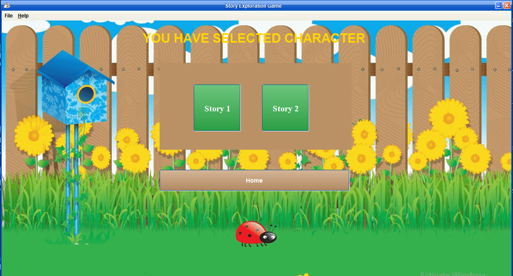

# Story-Exploration-Game_1
This assignment is to develop a simple game called “Story Exploration”. This game is developed using Object Oriented Programming language Java (Encapsulation and Abstraction). To develop the game Java platform is used.

